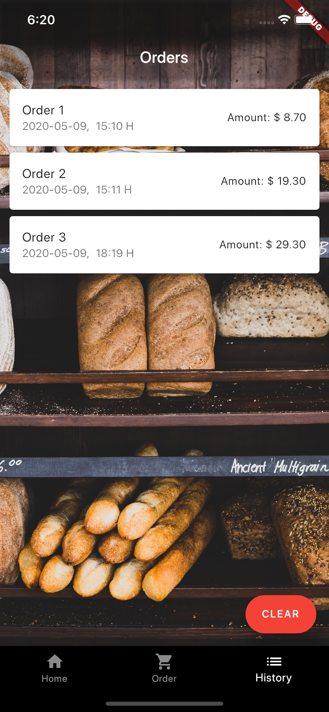

# Simple Bakery Order App

Simple Flutter application that allows users to register, login, add items to a shopping cart and view order history. Users will be able to logout and update name in settings from Home Page. Data is stored in Firebase Cloud Store.

## Examples:

 

  

## Improvements to make:

1. Allow users to update profile picture from Home Page.
2. Allow users to sort order history based on date.
3. Create TextFormField to allow users to key in quantity of bread.
4. Allow users to reset password/email.
5. UI/UX

## Getting Started

This project is a starting point for a Flutter application.

A few resources to get you started if this is your first Flutter project:

- [Lab: Write your first Flutter app](https://flutter.dev/docs/get-started/codelab)
- [Cookbook: Useful Flutter samples](https://flutter.dev/docs/cookbook)

For help getting started with Flutter, view our
[online documentation](https://flutter.dev/docs), which offers tutorials,
samples, guidance on mobile development, and a full API reference.
